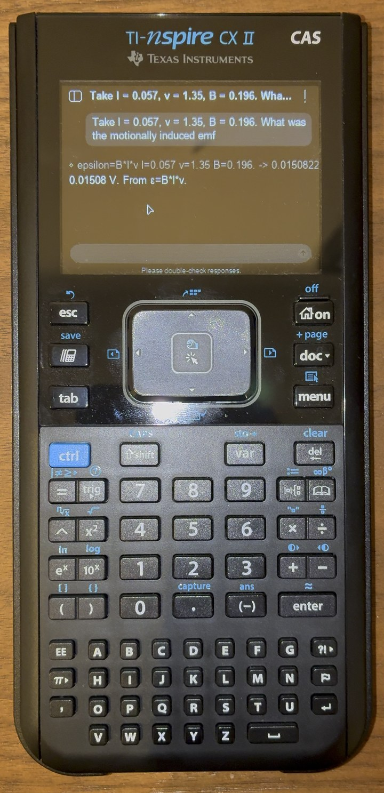
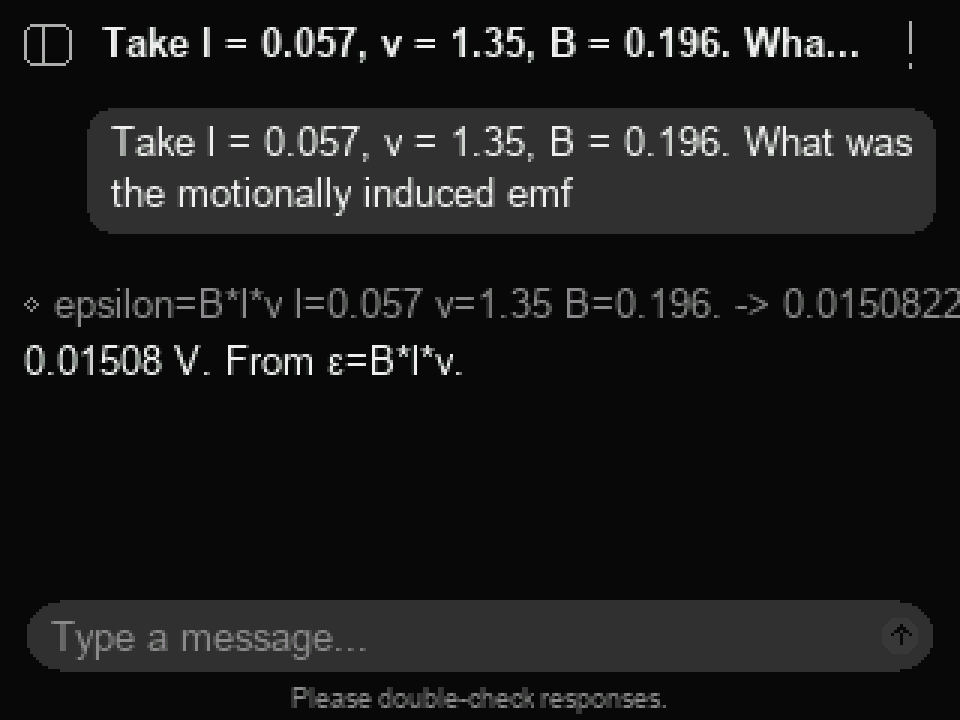

# Letting the Tools Do the Math: A 10.9M-Parameter Language Model on a Graphing Calculator

**Alexander Messerlian** · Independent Researcher, Palo Alto, CA, USA ·
ORCID [0009-0003-4933-6832](https://orcid.org/0009-0003-4933-6832)

**Paper:** [`paper/paper.pdf`](paper/paper.pdf), the anonymous copy for TMLR's double-blind review, and
[`paper/paper-preprint.pdf`](paper/paper-preprint.pdf), the named preprint, which is public on
[Preprints.org](https://www.preprints.org/manuscript/202609.2599).

ChatTLM is a physics assistant that runs entirely on a TI-Nspire CX II CAS: a 10.9M-parameter language
model, an int8 inference engine written in C, and a runtime that does the arithmetic the model asks for.
This repository holds the calculator application, the training and evaluation code, the data, every
measurement behind the paper, and the paper itself. The trained models and ready-to-copy calculator
files are in the [release](https://github.com/alex-messerlian/nspire-tlm/releases).

## Abstract

We decided to test the limits by building a physics assistant that runs natively on a TI-Nspire CX II CAS graphing
calculator: one ARM926EJ-S core at 396 MHz, with no floating-point unit, a maximum single memory allocation of about
21.5 MiB and no network. We use it as a case study in how the conclusions of a tiny-model evaluation depend on what
the evaluation runs. The 10.9M-parameter model never does the arithmetic itself: the runtime picks a relation from a
store, puts it in the prompt with the question's values, and runs the tool call the model writes. Given the correct
relation, the model is correct on 96.7% of problems that provide every value; its errors stem from incorrectly copied
digits, and an irrelevant value placed before the relevant ones lowers its score from 116 to 61 of 120, a pattern
consistent with the training generator's habit of adding irrelevant values last. End to end, on generated problems,
choosing the relation was initially the main limit: the system answered 21 of the same 120 problems correctly and
declined most of the rest. Two selection rules that use the values the question assigns raise this to 93 (and to 248
of 300 fresh problems from the same generators), while incorrect answers rise from 2 to 4. A rule-based path through
the same runtime with no model is correct more often and incorrect less often on every set that asks for a number; the
model declines more reliably. Differences between our harness and the calculator moved strict accuracy by 9 to 21
points and exposed an engine defect that a host–calculator comparison could not detect. A per-token cost model fitted
on battery predicts a decode run within 0.4%.

## On the calculator

<p>


</p>

*Left: a frame from the author's unedited video of the calculator answering the question of the paper's Figure 1, on
battery with no cable attached. Right: the same screen drawn by the application's own code, from the calculator
decoder's output replayed on a computer. The paper's Appendix B has more of both, and the video is attached to the
release.*

## Try it on a calculator

It was built and tested on a TI-Nspire CX II CAS with OS 6.4.0.74. The setup document supports OS 6.2.0 to 6.4.0.

1. From the [release](https://github.com/alex-messerlian/nspire-tlm/releases), download
   `chattlm-calculator-files.zip`, which holds the `chattlm` folder laid out as below, or the six calculator files
   one by one.
2. Copy them to the calculator in this layout (the folder names matter, and all three data files must be together):

   ```text
   My Documents/chattlm/ChatTLM Setup        ChatTLM_Setup.tns
   My Documents/chattlm/chattlm_support      chattlm_support.tns
   My Documents/chattlm/ChatTLM              ChatTLM.tns
   My Documents/chattlm/data/                store.tns.tns, tok4096.tok.tns, model4096.bin.tns
   ```

   Any program that copies documents to the calculator will do. If you build from source,
   `tools/nspire-cli/push-all.sh` sends everything from `build/` in this layout and checks every file by hash after
   sending it (see below).
3. Unplug the USB cable. With it attached the calculator runs at 288 MHz instead of 396 MHz.
4. Open **ChatTLM Setup** in the chattlm folder. It installs the support files and closes, and the home screen says
   "ChatTLM is ready". Then open **ChatTLM** in the same folder, type a physics question with its values, and press
   enter.

ChatTLM Setup installs [Ndless](https://github.com/ndless-nspire/Ndless), the loader that lets the calculator run
native programs, using Ndless's own installer (see [`installer/README.md`](installer/README.md)). A reset (the button
on the back) removes it, so open ChatTLM Setup again after every reset. If ChatTLM cannot find its files, it lists on
screen each folder it tried and which file was missing.

## Build from source

Tested on macOS on Apple silicon, with Python 3 and Homebrew. The host tests need only a C compiler and Python; the
calculator programs need the Ndless toolchain, which is built from source inside `vendor/`.

```bash
git clone https://github.com/alex-messerlian/nspire-tlm.git && cd nspire-tlm
python3 -m venv .venv-tok && .venv-tok/bin/pip install -r requirements.txt
tools/fetch_vendor.sh      # Ndless, llama2.c and libnspire, at the commits this was built against
make tests data            # host test programs; the corpus unpacked; the store and tokenizer packed
```

The calculator programs. `tools/build_toolchain_macos.sh` builds the ARM cross compiler (it downloads the GCC,
binutils and newlib sources with `wget`, needs Homebrew's `gmp`, `mpfr`, `libmpc`, `zlib` and `texinfo`, and takes a
while); the
SDK's libraries and tools are then built with the new compiler on `PATH`:

```bash
tools/build_toolchain_macos.sh
PATH="$PWD/vendor/Ndless/ndless-sdk/toolchain/install/bin:$PWD/vendor/Ndless/ndless-sdk/bin:$PATH" \
    make -C vendor/Ndless/ndless-sdk
make device setup          # build/chattlm.tns and build/ChatTLM_Setup.tns
make -C resources          # build/chattlm_support.tns, the loader
```

The model. Download `model4096.bin.tns` from the release into `build/transfer/`, or download `ship.pt` into `train/`
and export it at int8, group 88 (this also stages the store, the tokenizer and the app in `build/transfer/`):

```bash
tools/export_device.sh train/ship.pt 88
```

The transfer tool, which needs Homebrew's `libusb` and `pkg-config`:

```bash
(cd vendor/libnspire && ./configure --prefix="$PWD/_install" && make install)
make -C tools/nspire-cli
tools/nspire-cli/push-all.sh
```

## Checks

```bash
make check
```

builds the host programs and runs the test and check suite: 92 checks on the evaluator, the corpus generator, the
store, the prompt assembly, the tokenizer, the loader and the application's logic. For 44 of them,
`tools/eval/gate_controls.py` feeds in a deliberately broken input and confirms that the check then fails. Some
checks read the calculator programs and the model file; if any of those is missing, the suite names it and runs
nothing, rather than passing without it.

## Reproducing the paper

Every number in the paper is listed in [`docs/paper/FACTS.md`](docs/paper/FACTS.md) with the conditions it was
measured under and the file in `results/` it comes from. From there:

- **The data.** `corpus/generate.py` writes the synthetic corpus from the record store and the tables beside it
  (`corpus/synth_stamp.json` records the inputs of the committed copy). `tools/fetch_oer.sh` fetches the OpenStax
  books, and `train/prepare.py` mixes the two into the training stream.
  [`docs/paper/DATA_PROVENANCE.md`](docs/paper/DATA_PROVENANCE.md) describes both and their licenses.
- **Training.** The shipped model is the 8,000-step run
  `RUN=math1 SEED=1 DIM=352 LAYERS=6 HEADS=8 SEQ=512 BS=24 STEPS=8000 .venv-tok/bin/python train/select_run.py`
  ([`train/README.md`](train/README.md) lists every model file). It was trained on an earlier version of the corpus from the same generator, attached to the release as
  `synth_sample_shipped_model.jsonl.gz`; the corpus in `corpus/` is the one the width-ladder and fully trained models
  used. The pre-registrations of those runs are in `docs/`.
- **Scoring.** The scripts are in `tools/eval/`. `TAG=g88p tools/eval/score_on_device_decoder.sh 88 train/ship.pt`
  scores the shipped model with the calculator's own int8 decoder and writes `results/correct_int8_g88p_ship.json`
  and `results/arms_int8_g88p_ship.json`; `tools/eval/score_endtoend.py` runs the whole system with the
  application's own relation selection; FACTS.md names the script behind each figure.
- **Timings** need the calculator, on battery. [`bench/README.md`](bench/README.md) lists the benchmark programs,
  [`docs/HARDWARE.md`](docs/HARDWARE.md) the hardware measurements, and `results/device_g88p/` the logs of the shipped
  engine.

## Repository map

| Folder | What is in it |
|---|---|
| `paper/` | `paper.pdf` and `paper-preprint.pdf`, their LaTeX source, `references.bib`, `figures/`, TMLR's style files and the paper's license |
| `src/` | The inference engine (`runq_nspire.c`) and, in `src/store/`, the calculator application: interface, store loader, relation selection, prompt assembly, tokenizer and tool execution |
| `tools/eval/` | The evaluator the model's tool calls run on, the scoring harnesses, and the checks behind `make check` |
| `corpus/` | The record store, the corpus generator and its inputs, and the evaluation splits |
| `train/` | Data preparation and training; [`train/README.md`](train/README.md) lists the model files in the release |
| `results/` | Every measurement behind the paper's tables and figures, including the logs pulled from the calculator |
| `docs/` | The hardware measurements, the tool-call specification, the pre-registrations, and in [`docs/paper/`](docs/paper/) the paper's records: every number with its source, the citation log and the data provenance |
| `bench/` | The calculator benchmarks |
| `installer/`, `resources/` | The setup document and the loader, both derived from Ndless |
| `tools/paper/` | The paper's checks, figures, calculator screens and cost model |
| `tools/nspire-cli/` | USB transfer to the calculator |
| `submission/` | Notes on the photographs, the video and the supplementary material |

The documents in `docs/` are the records the paper relies on. They were written during the project, so some of them
refer to working notes that are not published; FACTS.md and the paper are current.

## Rebuilding the paper

Edit `paper/paper.tex`. Keep the `\label{...}` names, the `\ifdeanonymized ... \fi` blocks (they hide the author's name
in the review copy) and `\label{endofmain}` just before the statements (the length check uses it). Every number in the
text is listed in [`docs/paper/FACTS.md`](docs/paper/FACTS.md) with the file it comes from; check it there before
changing it. The tables and figures come from `results/`, so edit their captions freely but their numbers only through
FACTS.md and the scripts.

To rebuild the review copy:

```bash
cd paper && tectonic paper.tex
```

To rebuild both PDFs, write the preprint's LaTeX source `submission/preprint-source.zip`, and run every check (anonymity, citations,
fonts, figures, length), from the repository root:

```bash
.venv-fig/bin/python tools/paper/check_paper.py --final --preprint
```

The environment is `python3 -m venv .venv-fig && .venv-fig/bin/pip install -r tools/paper/requirements.txt`. The
figures are drawn from `results/` by `tools/paper/make_figures.py`. `--final` also cuts the photographs again from
the original recording, which is not published because it records where it was filmed; without it, leave out
`--final` and every other check still runs.

## Citation

If you use this work, please cite:

```bibtex
@misc{messerlian2026calculator,
  author       = {Alexander Messerlian},
  title        = {Letting the Tools Do the Math: A 10.9M-Parameter Language Model on a Graphing Calculator},
  howpublished = {Preprints.org, preprint 202609.2599},
  year         = {2026},
  url          = {https://www.preprints.org/manuscript/202609.2599}
}
```

[`CITATION.cff`](CITATION.cff) gives the same reference.

## License

The code is under the [MIT License](LICENSE). The loader and setup document derived from Ndless keep the Mozilla
Public License 1.1; the record store, the corpus and the model weights are under CC BY-NC-SA 4.0, following the
licenses of the OpenStax books they come from; and the paper is under [CC BY 4.0](paper/LICENSE.md).
[`NOTICE.md`](NOTICE.md) says which files each license covers.

## Contact

Alexander Messerlian, alex.messerlian@icloud.com
